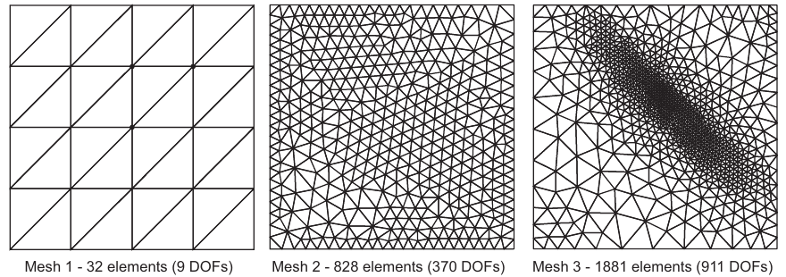
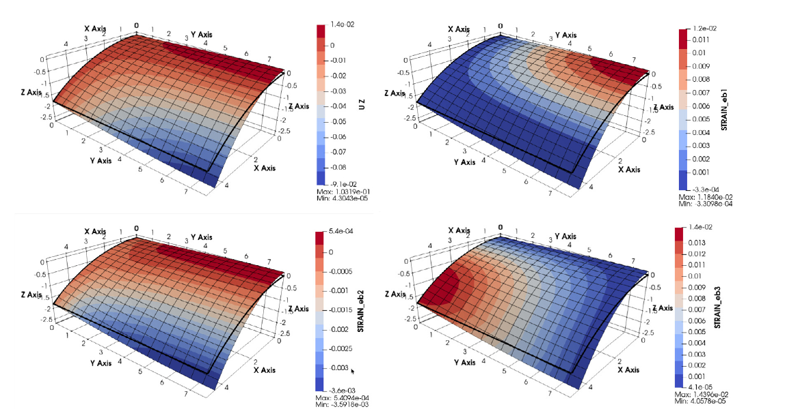
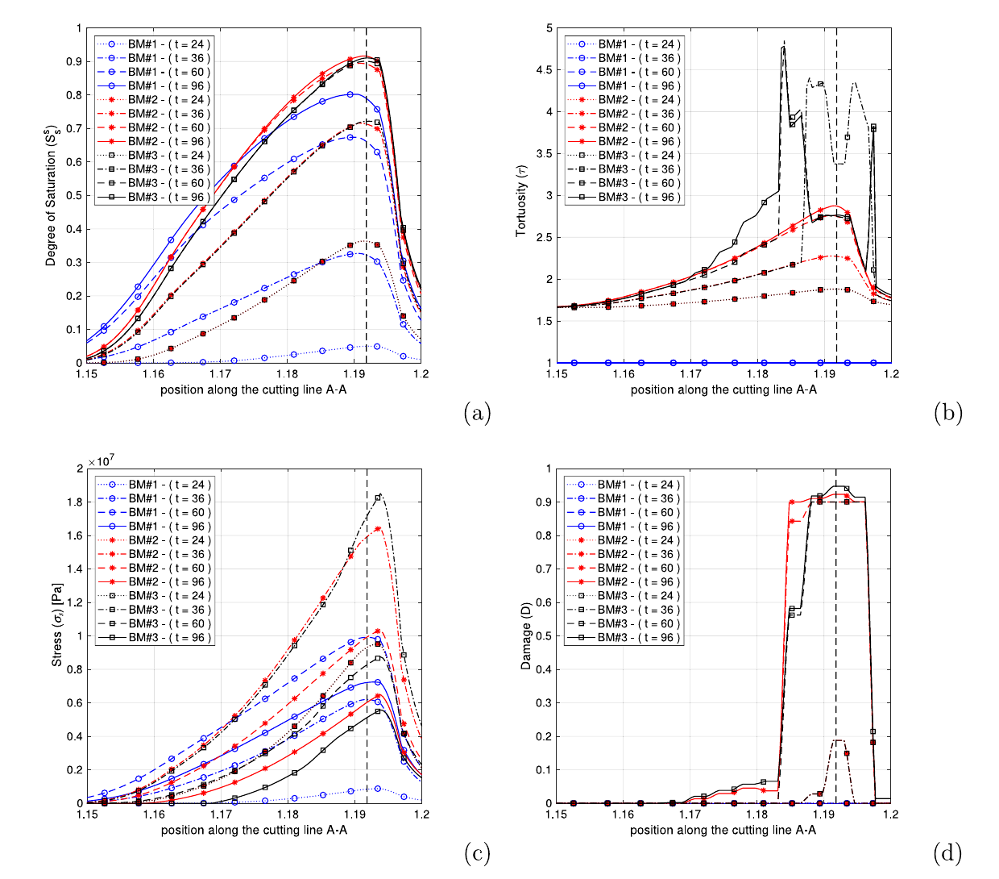

Browse the research albums, then use the research lines below to explore how
survey, numerical methods, material degradation and experiments connect.

## Albums

::: {#albums}
:::

## Research lines

::: {.grid .research-lines}

::: {.g-col-12 .g-col-md-6 .g-col-xl-4 .research-line-card}
{.research-line-cover}

### [Modelling cultural heritage from survey to structure](research.qmd#cultural-heritage-modelling)

From point clouds and BIM to analysis-ready models, damage diagnosis and structural assessment.

[Cloud2FEM](gallery/2026-01-cloud2fem.qmd) · [Garisenda](gallery/2026-03-cultural-heritage-garisenda.qmd)
:::

::: {.g-col-12 .g-col-md-6 .g-col-xl-4 .research-line-card}
{.research-line-cover}

### [Adaptive and reliable finite-element procedures](research.qmd#finite-element-procedures)

RCP, error estimation, adaptive refinement and automated structural assessment.
:::

::: {.g-col-12 .g-col-md-6 .g-col-xl-4 .research-line-card}
{.research-line-cover}

### [Finite-element formulations for plates, shells and beams](research.qmd#finite-element-formulations)

NIPE, PASE, Q4RS and beam elements designed for reliable structural analysis.

[FEM shell benchmarks](gallery/2026-02-fem-shell.qmd)
:::

::: {.g-col-12 .g-col-md-6 .g-col-xl-4 .research-line-card}
{.research-line-cover}

### [Multiphysics of salt transport and material degradation](research.qmd#multiphysics)

Coupled moisture, heat, salt transport, crystallisation and mechanical damage.
:::

::: {.g-col-12 .g-col-md-6 .g-col-xl-4 .research-line-card}
{.research-line-cover}

### [Sustainable and innovative construction materials](research.qmd#innovative-materials)

Olive-kernel mortars, FRCM composites and material characterisation for construction and repair.

[Innovative materials album](gallery/2026-04-innovative-materials.qmd)
:::

:::
