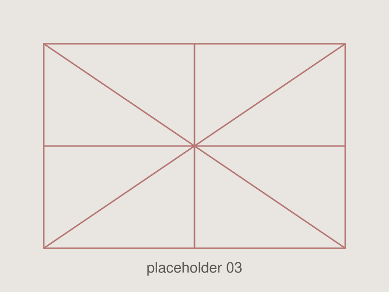
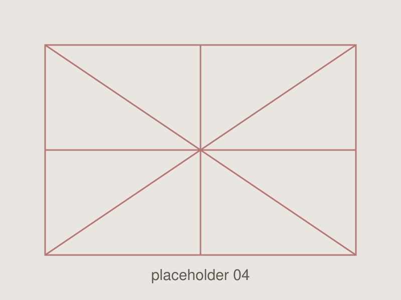

Sostituisci le immagini segnaposto con quelle vere: basta copiarle in
`assets/img/` e cambiare il percorso qui sotto. Cliccando su un'immagine si apre
in grande (lightbox già attivo per tutto il sito).

::: {layout-ncol=2}
{group="c2f"}

{group="c2f"}

{group="c2f"}

{group="c2f"}
:::
