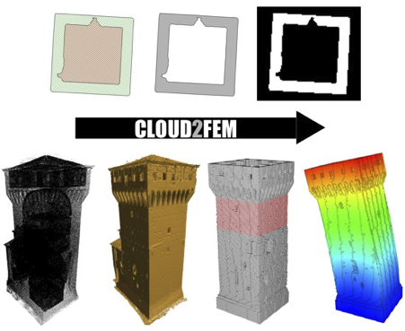
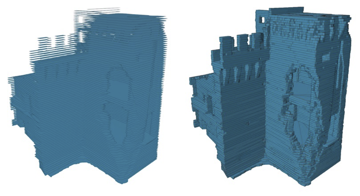
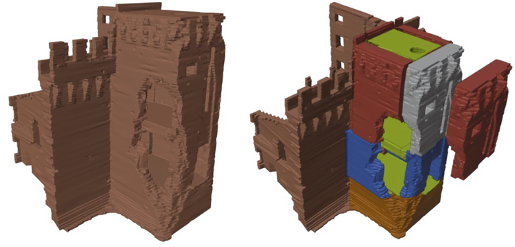
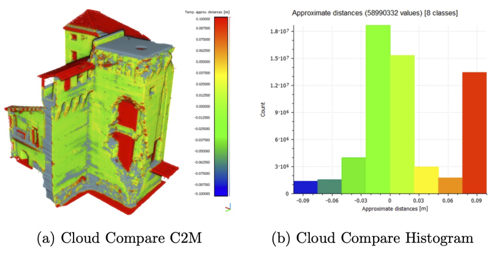

Images from the Cloud2FEM workflow, from point-cloud processing to finite-element modelling.

::: {.masonry-gallery}
{group="cloud2fem"}

{group="cloud2fem"}

{group="cloud2fem"}

{group="cloud2fem"}
:::
