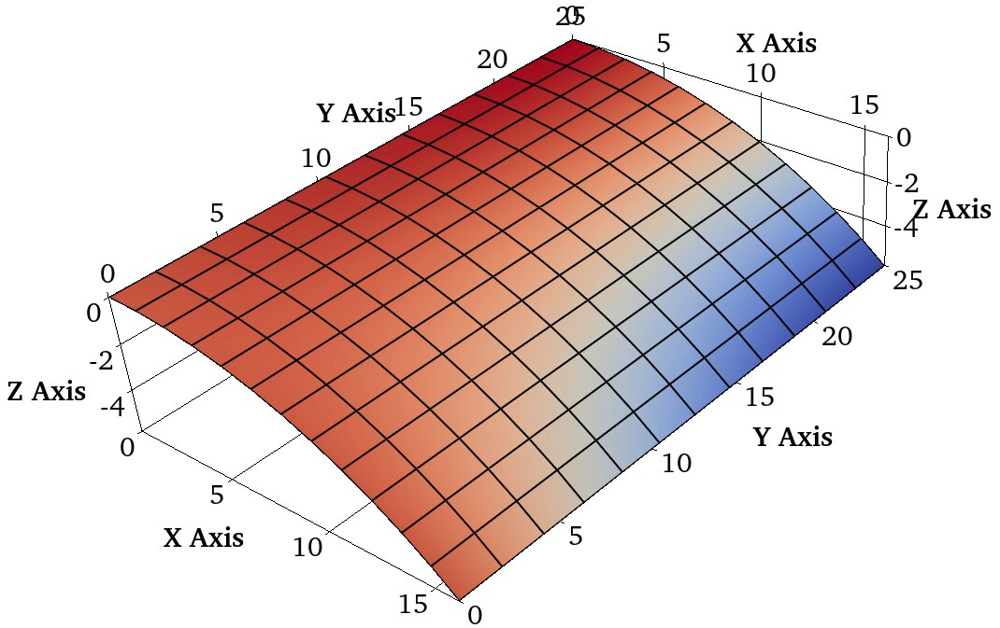
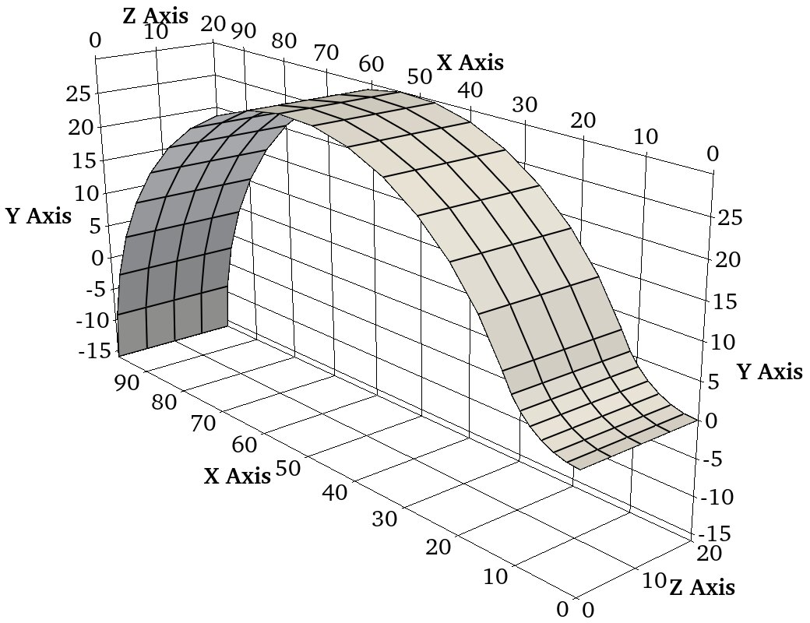
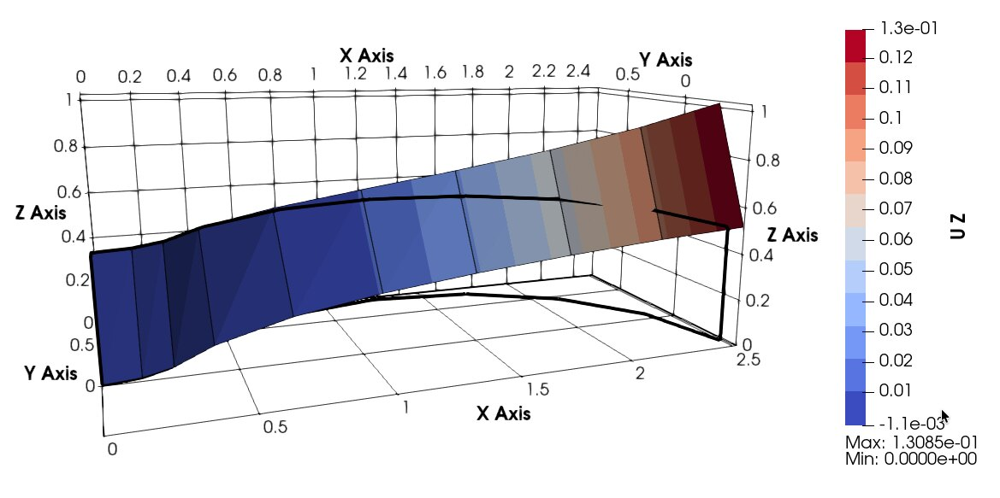
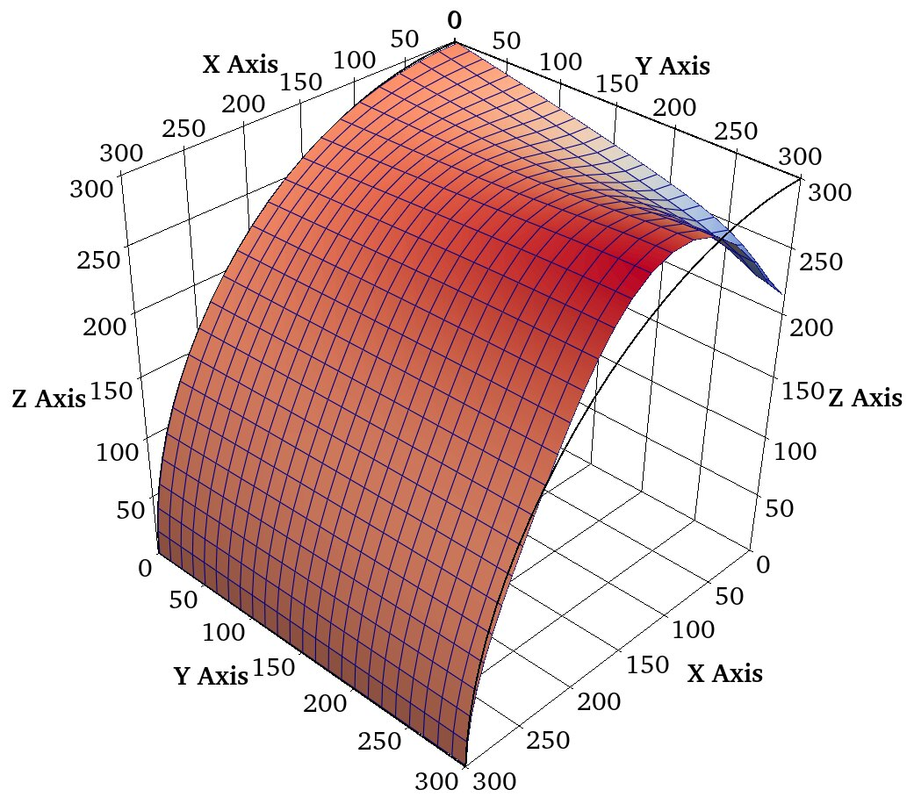
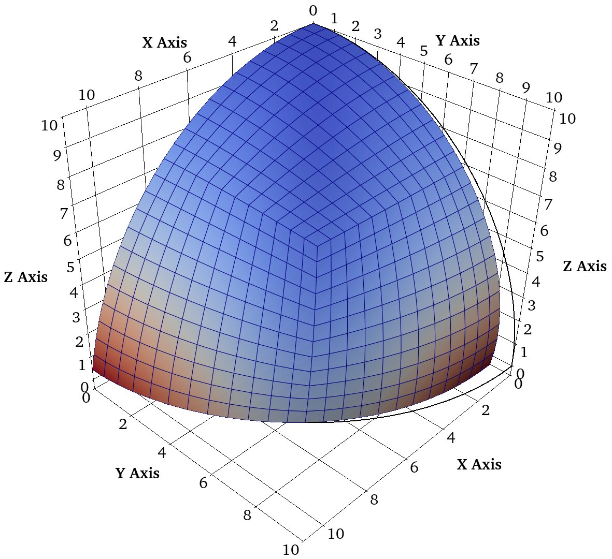
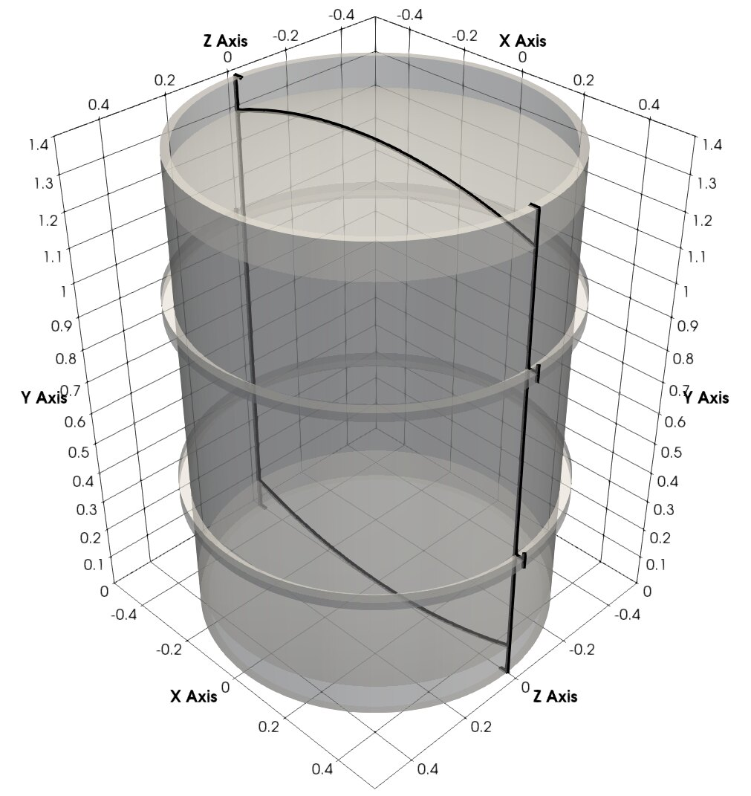

Benchmarks and mode-shape visualisation for the Q4RS shell element.

Barrel mode 8 animation:



::: {.masonry-gallery}
{group="fem-shell"}

{group="fem-shell"}

{group="fem-shell"}

{group="fem-shell"}

{group="fem-shell"}

{group="fem-shell"}
:::
