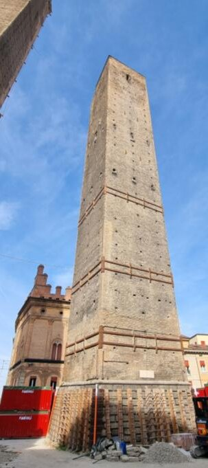
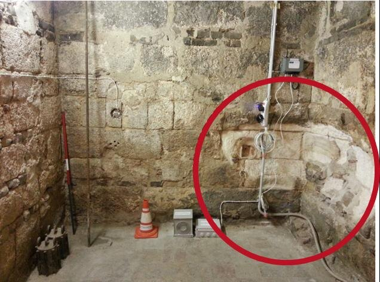
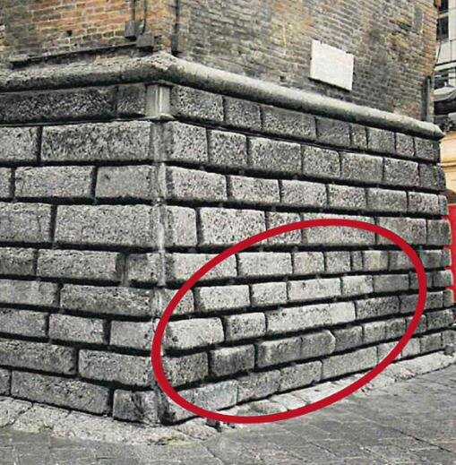
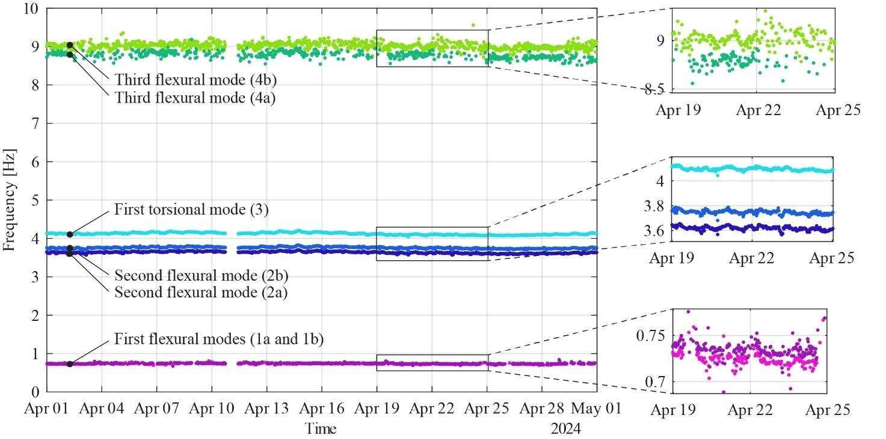
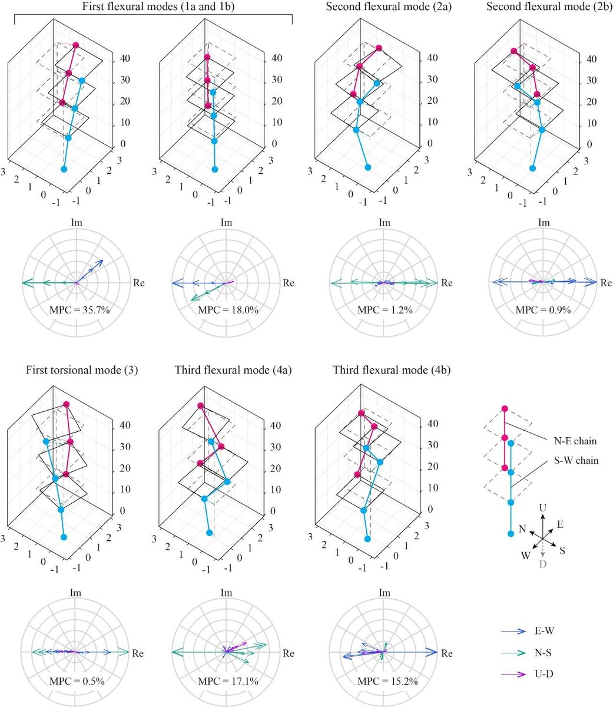
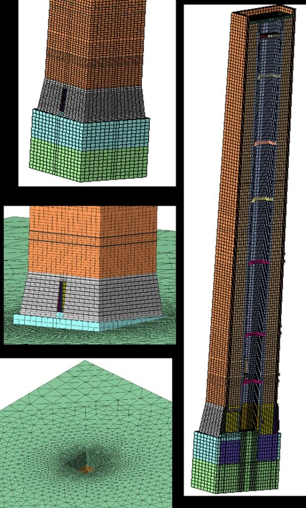
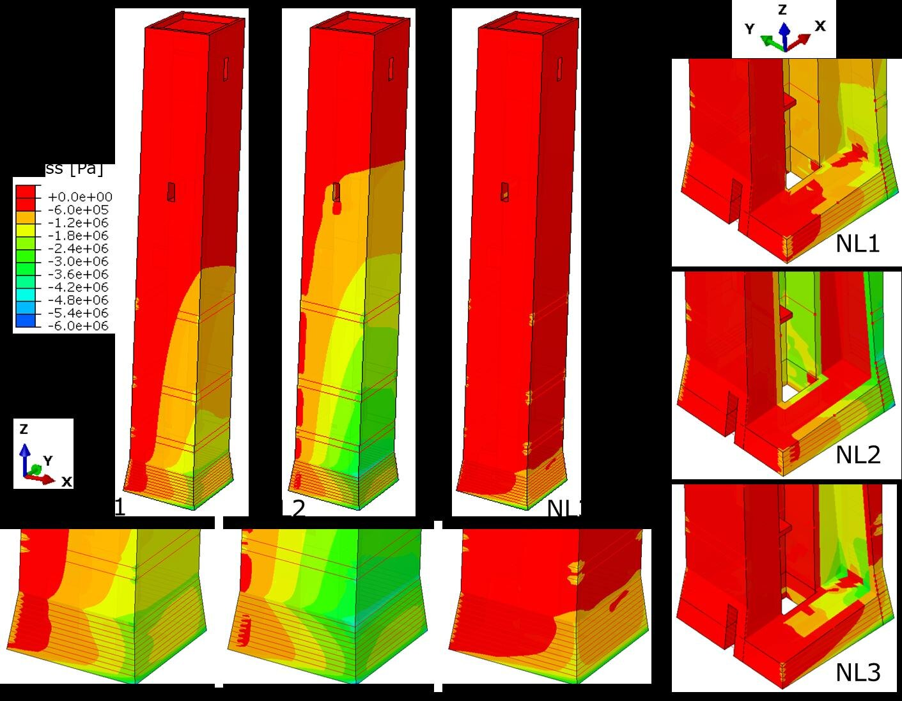

Images extracted from the Garisenda paper draft.

::: {.masonry-gallery}
{group="garisenda"}

{group="garisenda"}

{group="garisenda"}

{group="garisenda"}

{group="garisenda"}

{group="garisenda"}

{group="garisenda"}
:::
