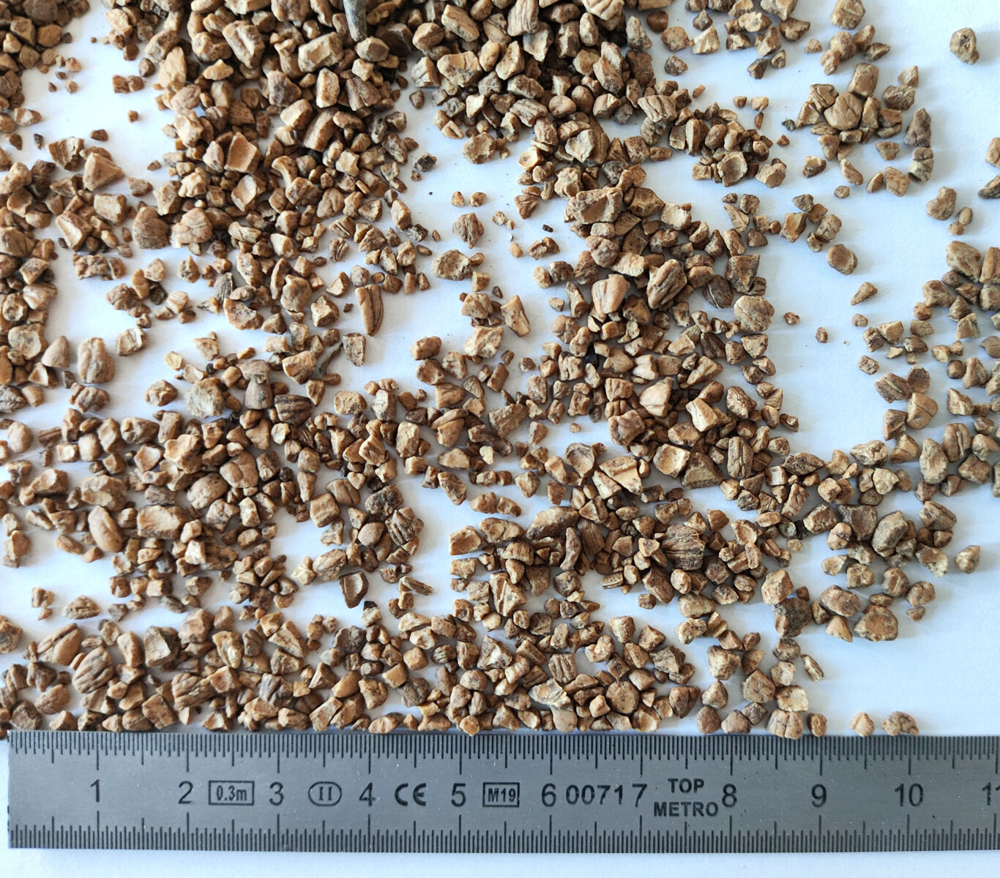
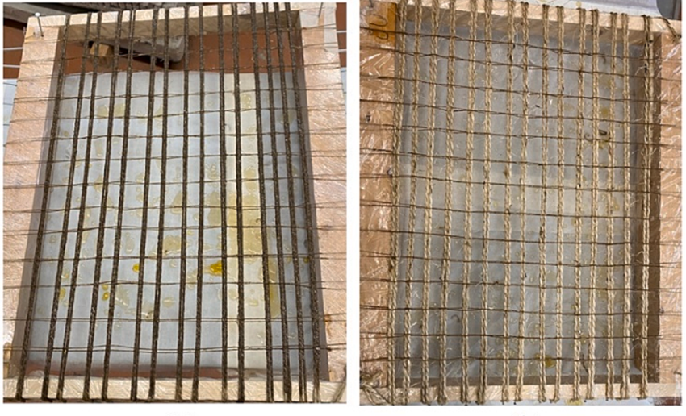
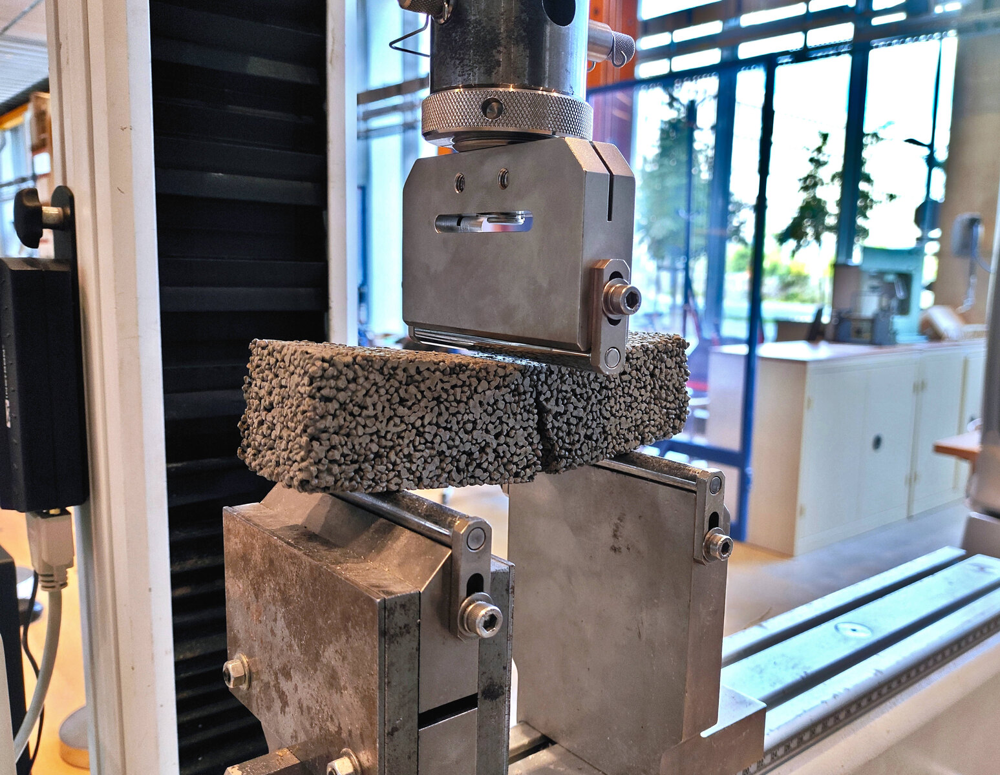
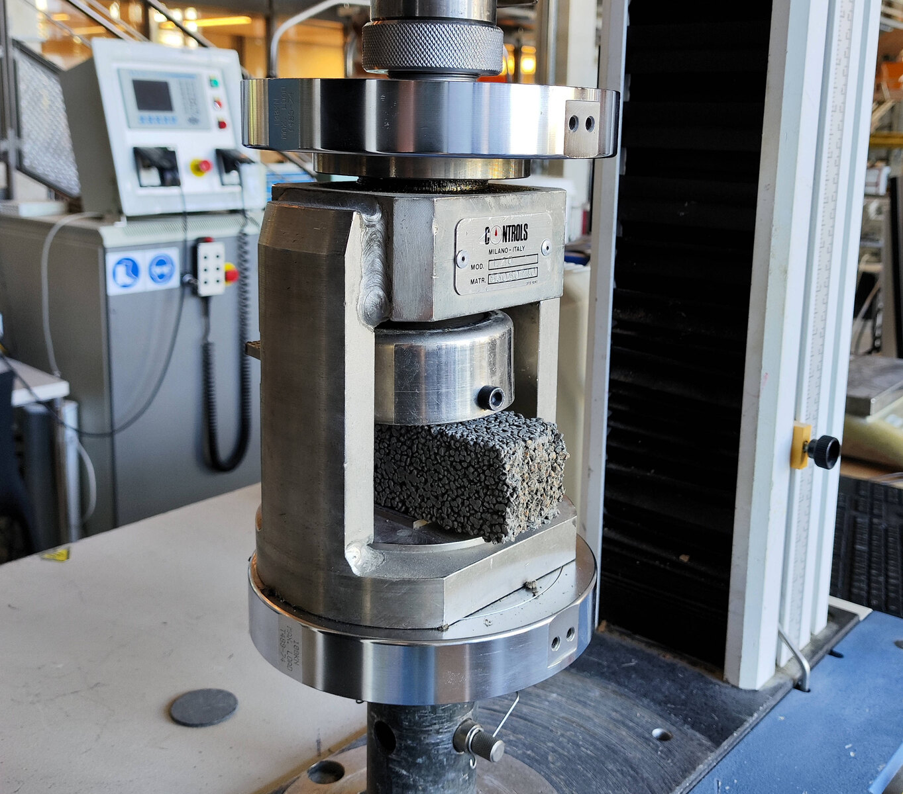
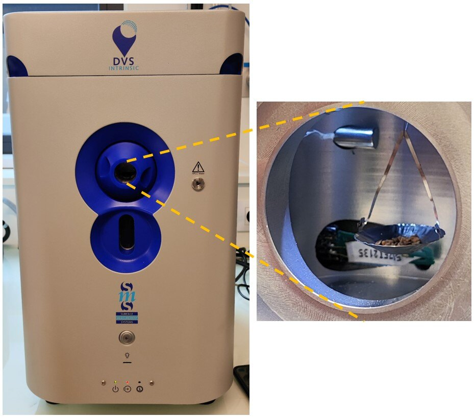
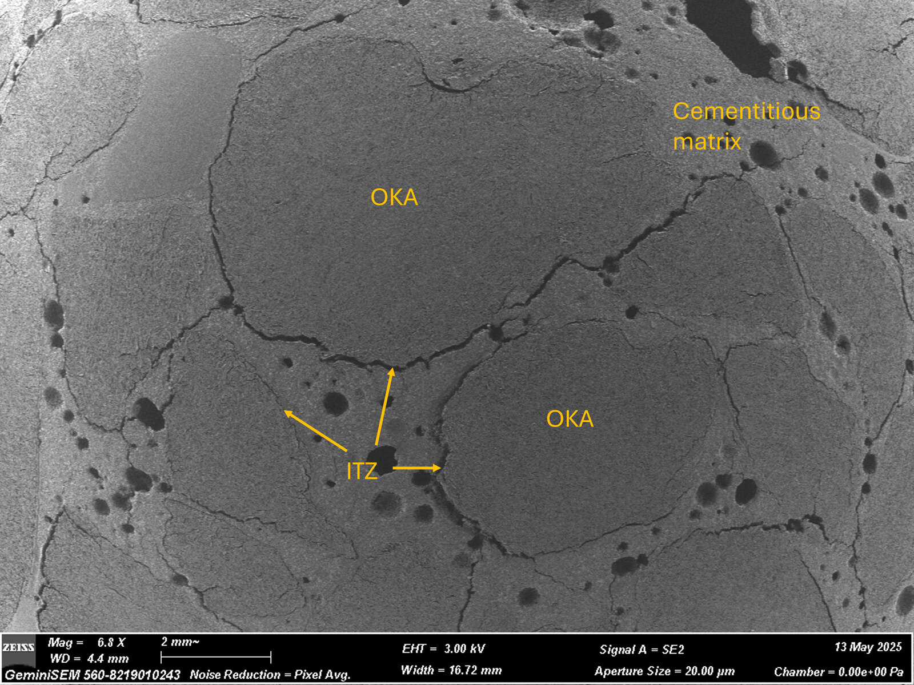
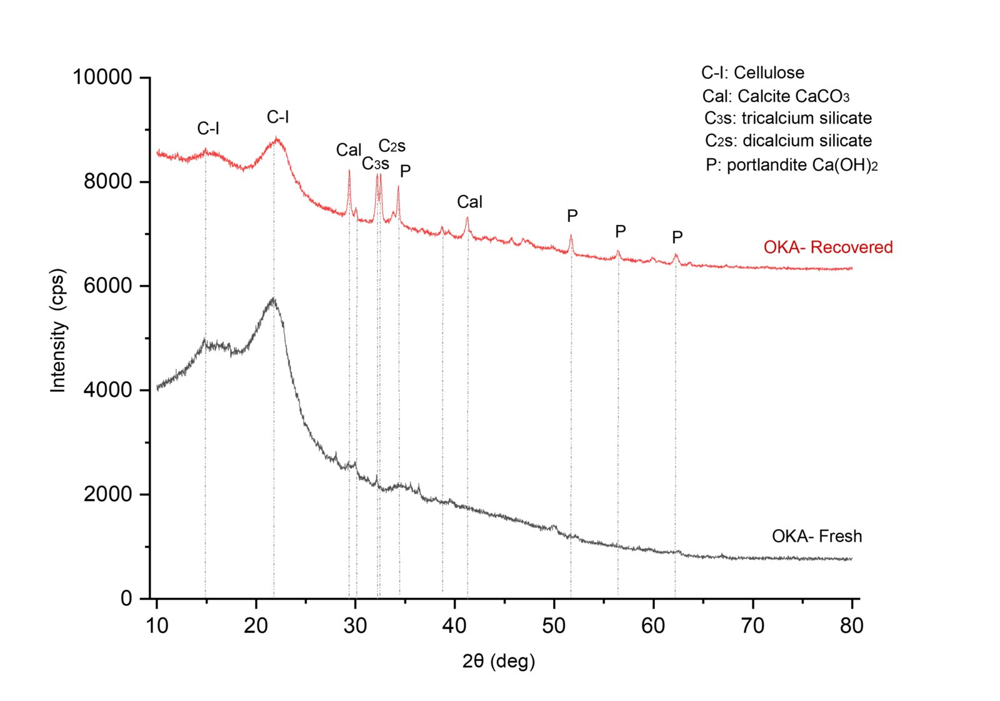

Experimental and microstructural evidence from bio-based mortars and
fabric-reinforced cementitious matrix (FRCM) composites.

::: {.masonry-gallery}
{group="materials"}

{group="materials"}

{group="materials"}

{group="materials"}

{group="materials"}

{group="materials"}

{group="materials"}
:::
