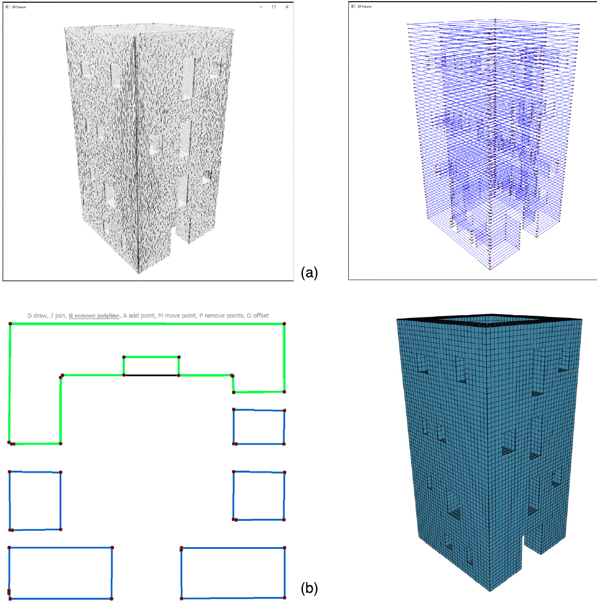

I am **Associate Professor** at the Department of Civil, Chemical, Environmental
and Materials Engineering (DICAM), University of Bologna, and President of
[AICO](https://www.aico-compositi.it), the Italian Association of Composites for
Civil Engineering Applications. I was a post-doctoral fellow at the University
of California San Diego and completed my PhD in Structural Mechanics at the
University of Bologna.

My work sits at the intersection of **computational structural mechanics** and the
**digital documentation of existing structures**. I develop numerical methods and
open-source tools that turn survey data — point clouds, CT scans, photogrammetry —
into predictive finite element models, with a particular focus on **masonry and
historical constructions**.

## Research in one paragraph

Existing buildings are geometrically irregular, materially heterogeneous and rarely
documented. Standard modelling pipelines assume none of that is true. I work on
closing the gap: automatic mesh generation from unstructured 3D data, constitutive
models for masonry and quasi-brittle materials, efficient shell and beam formulations,
virtual element methods for meshes that no classical FE code would accept, and
data-informed digital twins for structural monitoring and interpretation.

::: {.callout-note appearance="simple"}
Interested in collaborating, or looking for a thesis topic?
[Get in touch](mailto:giovanni.castellazzi@unibo.it).
:::

## The book

::: {.callout-important appearance="simple" icon=false}
### Principles and Analysis of Historical Masonry Structures {.unnumbered}
#### *The Strength of the Past* — Cambridge Scholars Publishing, 2025 {.unnumbered}

With Alberto Taliercio. How masonry structures stand, why they endure and when
they fail: the mechanics of arches, vaults, domes and walls, from thrust line
theory and the no-tension model to seismic action and long-term degradation.
498 pages, for engineers, architects, conservation professionals and students.

[Publisher's page](https://www.cambridgescholars.com/product/978-1-0364-5633-7/){.btn .btn-primary .btn-sm}
[All publications](publications.qmd){.btn .btn-outline-primary .btn-sm}
:::

## Highlights

::: {.grid}

::: {.g-col-12 .g-col-md-3}
### Cloud2FEM
From point cloud to finite element model, automatically.
[Read more →](software.qmd#cloud2fem)
:::

::: {.g-col-12 .g-col-md-3}
### Masonry mechanics
Texture-aware models, interface elements, damage and frost.
[Read more →](research.qmd)
:::

::: {.g-col-12 .g-col-md-3}
### Cultural heritage
Monitoring, survey data and modelling for historical structures.
[Open gallery →](gallery/2026-03-cultural-heritage-garisenda.qmd)
:::

::: {.g-col-12 .g-col-md-3}
### Structural digital twins
Semantic data and ontologies for connected, traceable structural models.
[Read more →](research.qmd#digital-twinning-and-structural-ontologies)
:::

:::

<article class="profile-gallery-slide" role="group" aria-roledescription="slide" aria-label="1 of 4">
<video muted loop playsinline preload="none" aria-label="Cloud2FEM point-cloud modelling demonstration">
<source src="assets/video/gallery/cloud2fem/cloud2fem_demo.mp4" type="video/mp4">
</video>

Cloud2FEM — point cloud to structural model

</article>
<article class="profile-gallery-slide" role="group" aria-roledescription="slide" aria-label="2 of 4">
<video muted loop playsinline preload="none" aria-label="Cloud2FEM animation of San Felice Fortress">
<source src="assets/video/gallery/cloud2fem/san-felice-fortress-cloud2fem.mp4" type="video/mp4">
</video>

San Felice Fortress — Cloud2FEM animation

</article>
<article class="profile-gallery-slide" role="group" aria-roledescription="slide" aria-label="3 of 4">
<video muted loop playsinline preload="none" aria-label="Animated barrel mode 8 shell simulation">
<source src="assets/video/gallery/fem-shell/animation_barrel_mode_8.mp4" type="video/mp4">
</video>

Barrel mode 8 — shell simulation

</article>
<article class="profile-gallery-slide" role="group" aria-roledescription="slide" aria-label="4 of 4">

From survey data to a finite-element model

</article>

<button type="button" data-gallery-previous aria-label="Previous slide">‹</button>
1 / 4
<button type="button" data-gallery-next aria-label="Next slide">›</button>
<button type="button" data-gallery-toggle aria-pressed="false">Pause</button>

